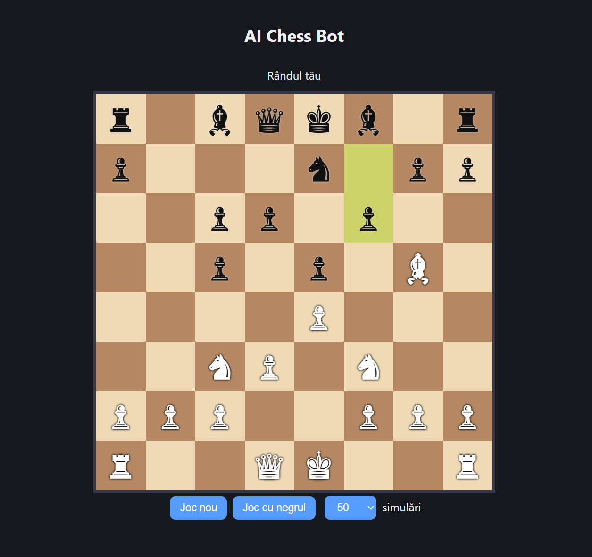

# ♟️ AI Chess Bot

An AlphaZero-style chess engine: a **ResNet policy + value network** guides a **Monte Carlo Tree Search (PUCT)**. The network is trained with **PyTorch** on millions of Stockfish-evaluated positions, exported to **ONNX**, and playable **entirely in the browser** with no backend.

**[▶ Play it live](https://dragos112358.github.io/ai-chess-bot/)** · estimated strength **~1900–2100 Elo** on Stockfish's `UCI_Elo` scale (see [Results](#results) for the caveats)



---

## Highlights

- **Supervised training on Stockfish labels** from the Lichess evaluation database (policy = soft distribution over Stockfish's top-6 moves, value = squashed centipawn score)
- **Batched MCTS** with virtual loss, an evaluation cache, tree reuse, fp16 inference and early stopping
- **Runs in the browser**: `onnxruntime-web` with WebGPU and automatic WASM fallback, inference in a Web Worker so the UI never blocks
- **Measured, not guessed**: Elo estimated by match play against Stockfish, with search strength swept from 50 to 800 simulations
- Full desktop app (pygame): play, prepare data, train, run an Elo arena, and duel a new model against the previous one

## Results

Matches against Stockfish 19 limited with `UCI_Elo`, 0.1 s per move, 20 games per level (colors alternated, random 4-ply openings shared by each pair of games), no opening book or tablebase. Score is from the bot's point of view (wins = draws = losses).

| MCTS sims | vs SF 1350 | vs SF 1500 | vs SF 1700 | Estimated Elo |
|---:|:---:|:---:|:---:|---:|
| 50  | 20-0-0 | 18-0-2 | 14-2-4 | ~1890 |
| 100 | 20-0-0 | 17-1-2 | 13-4-3 | ~1860 |
| 200 | 18-1-1 | 19-1-0 | 16-3-1 | ~2040 |
| 400 | 20-0-0 | 17-1-2 | 19-1-0 | ~1840 |
| 800 | 20-0-0 | 20-0-0 | 18-2-0 | ~2110 |

**How to read this honestly**

- The bot wins the large majority of games at every level, so it is clearly **stronger than Stockfish's 1700 setting**. The estimates are only **lower-bound-ish**: a 100% score (e.g. vs 1350) only says the opponent was too weak to measure against, and the formula caps the estimate.
- With 20 games per level the uncertainty is large (roughly ±150–200 Elo), which is why the estimate does **not rise monotonically** with simulations. The sweep shows a weak trend, not a precise curve.
- `UCI_Elo` is calibrated against Stockfish's own rating list at a specific time control, so these numbers are **not directly comparable to Lichess or FIDE ratings**.
- To tighten the estimate: test against higher Stockfish levels (1900–2200) with 100+ games each. A plain `Find_ELO.py` script is included for this.

## How it works

```
Lichess eval DB ─► labeled positions (data/*.npz) ─► PyTorch training ─► model.pt ─► export_onnx.py ─► model.onnx ─► browser
```

**Board encoding.** Each position is a `17 × 8 × 8` tensor from the point of view of the side to move (the board is flipped for black): 6 planes own pieces, 6 planes opponent pieces, 4 castling-rights planes, 1 en-passant plane. Positions are stored bit-packed (136 bytes each).

**Network.** A residual CNN (configurable depth and width; the default is 12 blocks × 192 channels) with two heads:
- **Policy:** logits over `64 × 64` (from-square × to-square), masked to legal moves.
- **Value:** a `tanh` scalar in `[-1, 1]` for the side to move.

**Training targets.** For each position the policy target is a softmax over Stockfish's top-6 moves (temperature 80 cp), and the value target is `tanh(cp / 400)` of the best line. The data pipeline can stream the Lichess evaluation database directly, or label PGN games with a local Stockfish.

**Training recipe.** AdamW with warmup and cosine decay, bf16 mixed precision, exponential moving average of the weights, left–right flip augmentation (only on positions without castling rights, where it is a valid symmetry), validation split **by game** to avoid leakage, and early stopping.

**Search.** PUCT with `c_puct = 1.5` and a first-play-urgency reduction of `0.15`. The desktop engine adds batched evaluation with virtual loss, a transposition cache, subtree reuse between moves, extra time when the top two moves are close, direct mate-in-1, and optional Polyglot opening book and Syzygy tablebase support. The browser version uses the same encoding and the same PUCT rule in a simpler, unbatched loop, with inference offloaded to a Web Worker.

## Browser app

- Play as white or black, search strength of 50 / 100 / 200 / 400 simulations
- Promotion picker, undo, evaluation bar (from the network's value head), legal-move hints, last-move highlight
- Full rules via `chess.js`: castling, en passant, check, mate, draws
- Mobile-friendly layout

## Run locally

The page loads `model.onnx` with `fetch`, so it has to be served over HTTP:

```bash
cd docs
python3 -m http.server 8000
```

Then open **http://localhost:8000**.

The desktop app (training, arena, duel):

```bash
pip install chess numpy pygame-ce zstandard torch
python Chess_bot.py
```

To measure Elo from a script:

```bash
python Find_ELO.py     # downloads Stockfish on first run, then plays the arena matches
```

## Project structure

```
.
├── Chess_bot.py      # desktop app: GUI, data prep, training, MCTS, arena, duel
├── Find_ELO.py       # Elo vs Stockfish for several simulation budgets
├── export_onnx.py    # PyTorch → ONNX export
├── chess_bot_settings.json
├── data/             # labeled position shards (.npz), not in the repo
├── checkpoints/      # model weights (.pt), not in the repo
└── docs/             # static web app served by GitHub Pages
    ├── index.html
    └── model.onnx
```

## Tech stack

Python · PyTorch · ONNX · onnxruntime-web (WebGPU / WASM) · Web Workers · JavaScript · chess.js · python-chess · pygame · GitHub Pages

## Limitations

- **No underpromotion for the bot:** the policy head predicts only from/to squares, so the bot always promotes to a queen (humans can pick any piece).
- **Supervised, not self-play:** the network imitates Stockfish's evaluations, so it inherits their strengths and biases; reinforcement learning from self-play is not implemented.
- **Browser vs desktop:** the browser engine is simpler (no batching, cache or tree reuse), so at equal simulations it can play differently from the measured desktop engine.
- The Elo estimate is noisy and relative to Stockfish's `UCI_Elo` scale (see [Results](#results)).

## Roadmap

- [x] Move inference into a Web Worker so the UI never blocks
- [x] Undo button and evaluation bar
- [x] Elo measurement against Stockfish
- [ ] Larger Elo test (higher Stockfish levels, 100+ games per level)
- [ ] More data and a stronger network, then self-play fine-tuning
- [ ] Underpromotion support in the policy head